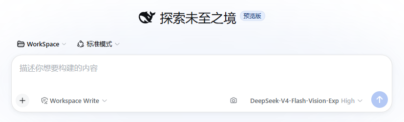
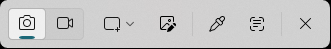
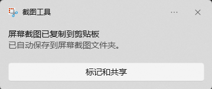
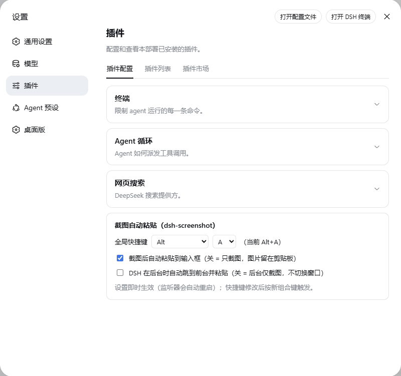

# dsh-screenshot

**Screenshot-to-input for DeepSeek Harness — 截图自动粘贴到 DSH 输入框**

One-click screenshot straight into the Harness composer: a camera button next to the input box, a global hotkey (default **Alt+A**), and a listener that follows the DSH Desktop app lifecycle. Everything is configurable from the plugin settings page.

一键截图并自动粘贴到 DeepSeek Harness 输入框：输入框旁的相机按钮、全局快捷键（默认 **Alt+A**）、监听器随 DSH Desktop 生命周期启停。快捷键、自动粘贴、后台跳转均可从设置页配置。

> **⚠️ 项目性质 / Project nature**：这是一个**纯 AI 生成的、面向新手**的项目（AI-generated, beginner-level code），未经专业安全审计，生产环境使用前请自行审阅代码。欢迎提 Issue / PR 改进。
>
> **🖥️ 平台 / Platform**：**仅支持 Windows 10（1809+）与 Windows 11**——依赖系统自带截图工具（`ms-screenclip:`）与 Win32 API。macOS / Linux / Windows 7/8 不支持。
>
> **🧭 建议搭配 / Recommended companion**：**[dsh-vision-router](https://github.com/ysr666/dsh-vision-router)** —— 截图自动粘进输入框后，由 vision-router 负责图片的视觉路由，实现「截图 → 提问 → 图片理解」的完整流程。

---

## 适用范围与 DSH Desktop 绑定（重要） / Scope & DSH Desktop binding (important)

**本插件是 DSH Desktop 专用**，与桌面版存在三层绑定：

1. **宿主生命周期 / Host lifecycle**：`lib/index.js`（node ESM 宿主插件）运行在 DSH Desktop 的主机进程内，随应用启动拉起监听器、应用关闭时停止。**浏览器版 Web 端没有这个宿主进程**，监听器无法自动启停。
2. **看门狗 / Watchdog**：监听器始终以 `-ExitWhenDshGone` 启动，监视 `DSH Desktop` 进程——检测不到该进程约 8 秒后自动退出。纯 Web 环境下监听器无法常驻。
3. **前台判断 / Foreground detection**：热键「是否自动粘贴」取决于 DSH Desktop 窗口是否在前台（`Get-Process 'DSH Desktop'` + `GetForegroundWindow`）。Web 端没有该窗口，行为等同「DSH 不在前台」——只截图、不自动粘贴。

**Web 端（浏览器版）能用吗？ / What about the Web version?**

- 部分可用、**未实测**、体验不完整。
- 相机按钮（`conversation.input.right` 槽位）与设置卡片属于客户端 UI，理论上能注入 Web 版输入框，点击走本机 `http://127.0.0.1:17890/trigger` 触发服务；
- 但触发服务需要监听器在跑——Web 版可改用**独立版监听器**（`dsh-screenshot-script/`，默认常驻、可开机自启、不带生命周期绑定）来提供；
- 受上述第 3 条限制，Web 版下自动粘贴判断不生效，截图只会留在剪贴板。

**结论 / Conclusion：以 DSH Desktop 使用为主；Web 端场景建议用独立版监听器，并接受行为受限。**

## Features / 功能

- 🖼️ **Camera button** in the composer tool row — click, snip, auto-paste
  输入框右侧**相机按钮**：点击 → 系统截图 → 拉框完成自动粘贴
- ⌨️ **Global hotkey** (default `Alt+A`, modifier/key configurable)
  全局**快捷键**（默认 `Alt+A`，修饰键与按键可配置）
- 🔄 **Listener bound to the app lifecycle** — starts with DSH Desktop, stops when it closes (no OS autostart needed)
  监听器随 **DSH Desktop 生命周期**启停（无需开机自启）
- ⚙️ **Settings page** — hotkey / auto-paste toggle / background-switch toggle, applied live
  **设置页**：快捷键 / 是否自动粘贴 / 后台是否跳转粘贴，即时生效
- 🧹 **Resilient** — non-blocking clipboard wait, single-flight debounce, cancel detection, stale SnippingTool cleanup, watchdog fallback
  可靠性：非阻塞等待、单飞防抖、取消检测、SnippingTool 卡死自愈、看门狗兜底

## Screenshots / 截图

| Screenshots / 截图 | Description / 说明 |
|---|---|
|  | DSH Desktop composer with the camera button in the tool row / 输入框工具行里的相机按钮 |
|  | System snipping tool (camera highlighted) / 系统截图工具（相机高亮） |
|  | Screenshot copied to clipboard & saved automatically / 截图已复制到剪贴板并自动保存 |
|  | `dsh-screenshot` plugin settings card / 插件设置卡片 |

## Requirements / 使用环境

- **Windows 10（1809+）/ Windows 11** — uses the built-in system Snipping Tool
  (`ms-screenclip:`) and Win32 APIs（hotkey registration, clipboard, foreground
  switching）; PowerShell 5.1 ships with both OSes.
  **Windows 10（1809+）与 Windows 11 均支持**：依赖系统自带截图工具
  （`ms-screenclip:`）与 Win32 API（热键注册、剪贴板、前台切换），
  PowerShell 5.1 两者均自带，无需额外安装。
- **DeepSeek Harness Desktop**（`desktop` profile）— requires the client/host
  plugin mechanism（详见上方「DSH Desktop 绑定」）。
  **DSH Desktop 应用**（`desktop` profile）：需要客户端/宿主插件机制（绑定关系见上）。
- **Not supported / 不支持**：macOS / Linux（PowerShell + Win32 + 系统截图工具
  均为 Windows 专属）；Windows 7/8（无 `ms-screenclip:`，且未自带 PowerShell 5.1）。

## Install / 安装

**From GitHub / 从 GitHub 安装**（需机器上有 dsh CLI）：

```powershell
dsh plugin --profile desktop add github:alain-prot0s5/dsh-screenshot
# or / 或
dsh plugin add https://github.com/alain-prot0s5/dsh-screenshot
```

**From npm / 从 npm 安装**（DSH Desktop 市场受管安装，走标准插件验证）：

```powershell
dsh plugin add @alain-prot0s5/dsh-screenshot
```

**Manual / 手动安装**（Desktop app 无独立 CLI 时）：

```powershell
# 1) copy the package into the profile's node_modules under its FULL package name
#    (DSH Desktop >= 2.0.2 enforces package identity: the folder, the manifest
#    `name`, the bundle entry and the client id must all be the scoped name)
New-Item -ItemType Directory -Force "$env:USERPROFILE\.dsh\profiles\desktop\node_modules\@alain-prot0s5"
Copy-Item -Path '<this folder>' -Destination "$env:USERPROFILE\.dsh\profiles\desktop\node_modules\@alain-prot0s5\dsh-screenshot" -Recurse
# 2) add "@alain-prot0s5/dsh-screenshot" to dsh.profile.bundles in the profile
#    package.json (UTF-8 WITHOUT BOM!)
# 3) restart DSH Desktop
```

> **DSH Desktop >= 2.0.2 compatibility / 兼容性说明**：the loader requires the
> profile bundle entry, the plugin manifest `name`, the `cordis.patch.yml` row
> `name` and the client bundle id to all be the exact npm package name
> `@alain-prot0s5/dsh-screenshot` (no bare short names). This package complies.
> DSH Desktop 2.0.2+ 要求 profile 的 bundles 条目、插件 package.json 的 `name`、
> `cordis.patch.yml` 行 `name`、客户端 bundle id 全部等于完整包名
> `@alain-prot0s5/dsh-screenshot`（不能用短名）。本包已按此规范发布。

Restart and you should see the camera button next to the composer; the listener log is `dsh-screenshot.log` inside the plugin folder (look for `模式：热键=… 自动粘贴=… 后台跳转粘贴=…`).
重启后输入框旁出现相机按钮；监听器日志在插件目录 `dsh-screenshot.log`（启动行含"模式：热键=… 自动粘贴=… 后台跳转粘贴=…"）。

## Settings / 设置项（设置 → 插件 → 可配置插件 → dsh-screenshot）

| Setting / 设置 | Default / 默认 | Description / 说明 |
|---|---|---|
| Global hotkey / 全局快捷键 | Alt+A | Modifier + key (A–Z); listener restarts automatically / 修饰键 + 键（A–Z），修改后自动生效 |
| Auto-paste to input / 自动粘贴到输入框 | On / 开 | Off = snip only, image stays in clipboard / 关 = 只截图，图片留在剪贴板 |
| Switch to foreground & paste when DSH is in background / 后台跳转粘贴 | Off / 关 | On = always bring DSH to front and paste / 开 = 后台触发时也切到前台并粘贴 |

## How it works / 原理

- **Client / 客户端**：camera button（keeps composer focus via `onMouseDown preventDefault`）+ settings card（`settingsScope`）
- **Host / 宿主**：starts/stops the bundled `dsh-screenshot.ps1 -ExitWhenDshGone`；registers the `dsh-screenshot` settings namespace，restarts the listener on change
- **Listener / 监听器**：`ms-screenclip:` opens the system snip（no synthetic keystrokes）→ waits for the clipboard（non-blocking + single-flight + cancel detection）→ `Ctrl+V`；auto-exits ~8 s after the DSH process disappears（watchdog）

## Files / 文件

- `lib/client.js` — camera button + settings card（ModuleLoader format，no build step）
- `lib/index.js` — host：listener lifecycle + settings namespace
- `dsh-screenshot.ps1` — bundled listener script（standalone copy kept in sync with `dsh-screenshot-script/`）
- `cordis.patch.yml` / `package.json` — bundle manifest（`dsh.bundle.patch` + `dsh.client`）

## License

[MIT](LICENSE)
